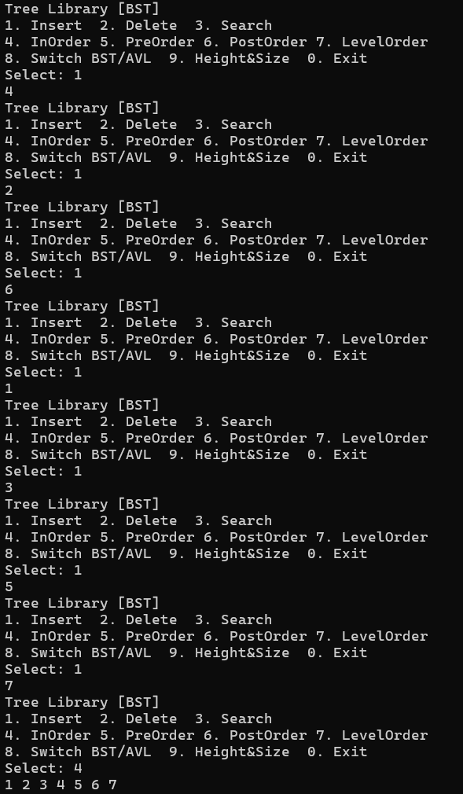

# DSA-Tree-Library-BST-AVL

> **This project is a work in progress.** Some features are still being implemented and tested. Code may change significantly between commits.

A ground-up implementation of **Binary Search Trees** and **self-balancing AVL Tree** in C++. This project focuses on the core mechanics of tree data structures, utilizing custom structs and functions to bypass standard libraries and master low-level memory management and balancing logic.

---

## Project structure

```
DSA-Tree-Library-BST-AVL/
├── src/
│   ├── Node.h
│   ├── BST.h / BST.cpp
│   ├── AVL.h / AVL.cpp
│   └── main.cpp
├── test_cases.txt
├── screenshots/
└── README.md
```

---

## Features

### Binary Search Tree

| Function | Description |
|---|---|
| `Insert(root, x)` | Recursive insert, returns new root |
| `Delete(root, x)` | Handles all 3 cases: leaf, 1 child, 2 children |
| `Search(root, x)` | Returns `Node*` or `nullptr` |
| `inOrder(root)` | Left → Root → Right |
| `preOrder(root)` | Root → Left → Right |
| `postOrder(root)` | Left → Right → Root |
| `levelOrder(root)` | BFS using `std::vector` as a queue |
| `Height(root)` | Tree height |
| `sizeOf(root)` | Node count |

### AVL Tree — self-balancing

| Function | Description |
|---|---|
| `insertAVL(root, data)` | Insert + rebalance on every recursive return |
| `deleteAVL(root, data)` | Delete + rebalance on every recursive return |
| `rotateRight(y)` | LL case |
| `rotateLeft(x)` | RR case |
| `rebalance(node)` | Detects imbalance and applies correct rotation (LL / LR / RR / RL) |
| `getBalanceFactor(node)` | `height(left) − height(right)` |

> All traversals, `Search`, `Height`, and `sizeOf` are shared — AVL reuses BST functions directly.

---

## Complexity analysis

| Operation | BST average | BST worst | AVL worst |
|---|:---:|:---:|:---:|
| Insert | O(log n) | **O(n)** | O(log n) |
| Delete | O(log n) | **O(n)** | O(log n) |
| Search | O(log n) | **O(n)** | O(log n) |
| Traversal | O(n) | O(n) | O(n) |
| Rotation | — | — | O(1) |

BST degrades to O(n) when inserting a sorted sequence — the tree becomes a linked list. AVL prevents this by rebalancing after every operation, keeping height bounded at O(log n).

---

## Setup guide

```bash
git clone https://github.com/<your-username>/DSA-Tree-Library-BST-AVL.git
cd DSA-Tree-Library-BST-AVL

g++ -std=c++17 src/BST.cpp src/AVL.cpp src/main.cpp -o main

./main
```

Requires `g++` with C++17 support. Works on Linux, macOS, and Windows (MinGW).

---

## Key test cases

| Input | Expected |
|---|---|
| Insert `4,2,6,1,3,5,7` → inOrder | `1 2 3 4 5 6 7` |
| BST insert `1,2,3,4,5` → Height | `5` (degenerate tree) |
| AVL insert `1,2,3,4,5` → Height | `3` (balanced) |
| Delete root node → inOrder | Correct order maintained |

See [`test_cases.txt`](./test_cases.txt) for the full suite.

---

## Screenshots



---

## Author

**An Huỳnh** — [@htan2612](https://github.com/htan2612)
